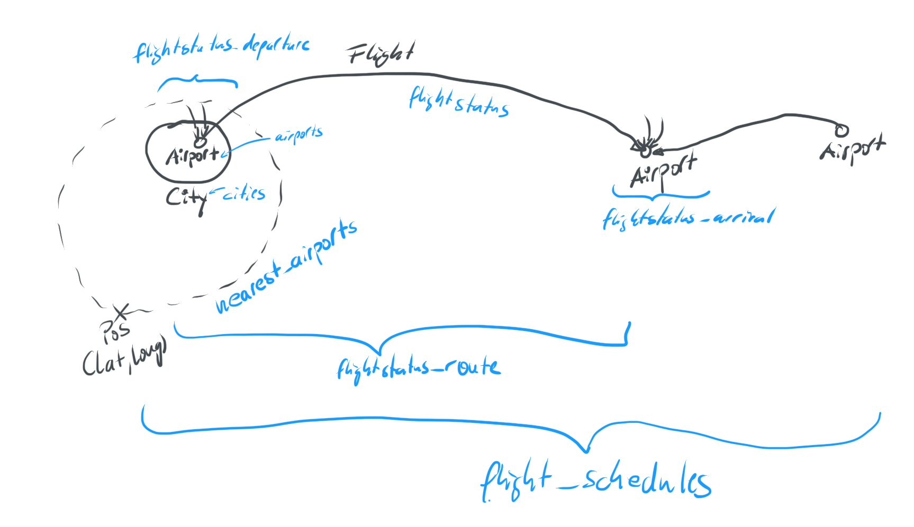

# Lufthansa Open API
This module is wrapping the [LH Open API](https://developer.lufthansa.com/docs/read/Home) with Python.

## provided functions

### reference data
- [get_airport_data](https://developer.lufthansa.com/docs/read/api_details/reference_data/Airports)
- [get_airline_data](https://developer.lufthansa.com/docs/read/api_details/reference_data/Airlines)
- [get_cities_data](https://developer.lufthansa.com/docs/read/api_details/reference_data/Cities)
- [get_countries_data](https://developer.lufthansa.com/docs/read/api_details/reference_data/Countries)
- [get_nearest_airports](https://developer.lufthansa.com/docs/read/api_details/reference_data/Nearest_Airport)
- [get_aircraft_data](https://developer.lufthansa.com/docs/read/api_details/reference_data/Aircraft), 
get all aircrafts by omitting parameter

### operations
- [get_flight_schedules](https://developer.lufthansa.com/docs/read/api_details/operations/Find_Schedules)
- [get_arrivals](https://developer.lufthansa.com/docs/read/api_details/operations/Flight_Status_by_Airport)
- [get_departures](https://developer.lufthansa.com/docs/read/api_details/operations/Departures_Status)
- [get_flight_route](https://developer.lufthansa.com/docs/read/api_details/operations/Flight_Status_by_City_Pair)
- [get_flight_status](https://developer.lufthansa.com/docs/read/api_details/operations/Flight_Status)